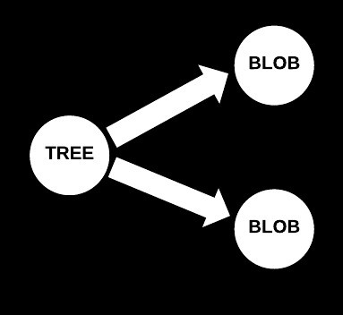
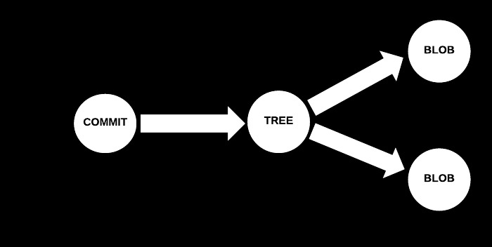
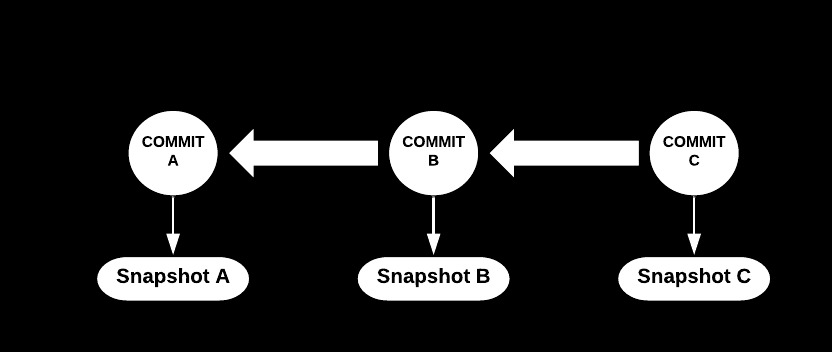

### Understanding Git

#### Even the scary parts 

Note:
Does the emoji show up

---
<!-- ---?image=assets/image/code.jpg&opacity=1 -->

### First, a bit about my journey so far

---

### November 2015
#### Graduate Software Engineer @ Boeing

- Never used version control before | 
- Very scared of git |
- Used Bitbucket for code reviews |

---

### July 2017
#### Software Engineer @ RedHat

- Worked on open source Beaker project |
- Use Gerrit for code reviews |
- Now less scared of git (i think...) |

---

### Topics we'll cover...

- How Git's storage works
- what is a branch
- rebase Vs. merge

---

## Storage

---

## Blob

- Git's representation of the version of a file


---

## Tree object

- Lists contents of directory
- Stores which filenames correspond to which blob, access modes...
- Points to the blob(s)




---


## Commit object

- Contains commit metadata
- Points to corresponding tree object 
- Also points to any parent commit(s)



Note:
So it can know the state of the files at the time of the commit. No parent means initial commit
---
### Git Branch



---

## Template Features

- Code Presenting |
- Repo Source, Static Blocks, GIST |
- Custom CSS Styling |
- Slideshow Background Image |
- Slide-specific Background Images |
- Custom Logo, TOC, and Footnotes |

---

---
---?code=src/go/server.go&lang=golang&title=Golang File

@[1,3-6](Present code found within any repo source file.)
@[8-18](Without ever leaving your slideshow.)
@[19-28](Using GitPitch code-presenting with (optional) annotations.)

---

@title[JavaScript Block]

<p><span class="slide-title">JavaScript Block</span></p>

```javascript
// Include http module.
var http = require("http");

// Create the server. Function passed as parameter
// is called on every request made.
http.createServer(function (request, response) {
  // Attach listener on end event.  This event is
  // called when client sent, awaiting response.
  request.on("end", function () {
    // Write headers to the response.
    // HTTP 200 status, Content-Type text/plain.
    response.writeHead(200, {
      'Content-Type': 'text/plain'
    });
    // Send data and end response.
    response.end('Hello HTTP!');
  });

// Listen on the 8080 port.
}).listen(8080);
```

@[1,2](You can present code inlined within your slide markdown too.)
@[9-17](Displayed using code-syntax highlighting just like your IDE.)
@[19-20](Again, all of this without ever leaving your slideshow.)

---?gist=onetapbeyond/494e0fecaf0d6a2aa2acadfb8eb9d6e8&lang=scala&title=Scala GIST

@[23](You can even present code found within any GitHub GIST.)
@[41-53](GIST source code is beautifully rendered on any slide.)
@[57-62](And code-presenting works seamlessly for GIST too, both online and offline.)

---

## Template Help

- [Code Presenting](https://github.com/gitpitch/gitpitch/wiki/Code-Presenting)
  + [Repo Source](https://github.com/gitpitch/gitpitch/wiki/Code-Delimiter-Slides), [Static Blocks](https://github.com/gitpitch/gitpitch/wiki/Code-Slides), [GIST](https://github.com/gitpitch/gitpitch/wiki/GIST-Slides)
- [Custom CSS Styling](https://github.com/gitpitch/gitpitch/wiki/Slideshow-Custom-CSS)
- [Slideshow Background Image](https://github.com/gitpitch/gitpitch/wiki/Background-Setting)
- [Slide-specific Background Images](https://github.com/gitpitch/gitpitch/wiki/Image-Slides#background)
- [Custom Logo](https://github.com/gitpitch/gitpitch/wiki/Logo-Setting) [TOC](https://github.com/gitpitch/gitpitch/wiki/Table-of-Contents) [Footnotes](https://github.com/gitpitch/gitpitch/wiki/Footnote-Setting)

---

### Template Versions

- #### [Base Template  @fa[external-link gp-download]](https://gitpitch.com/gitpitch/templates/black)
- #### [Code Maximized @fa[external-link gp-download]](https://gitpitch.com/gitpitch/templates/black?p=codemax)
- #### [Speaker Notes @fa[external-link gp-download]](https://gitpitch.com/gitpitch/templates/black?p=speaker)

---

### Questions?

<br>

@fa[twitter gp-contact](@gitpitch)

@fa[github gp-contact](gitpitch)

@fa[medium gp-contact](@gitpitch)

---?image=assets/image/gitpitch-audience.jpg&opacity=100

@title[Download this Template!]

### Get your presentation started!
### [Download this template @fa[external-link gp-download]](https://gitpitch.com/template/download/black)
