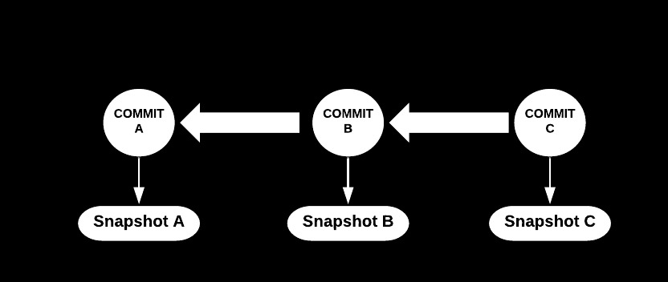
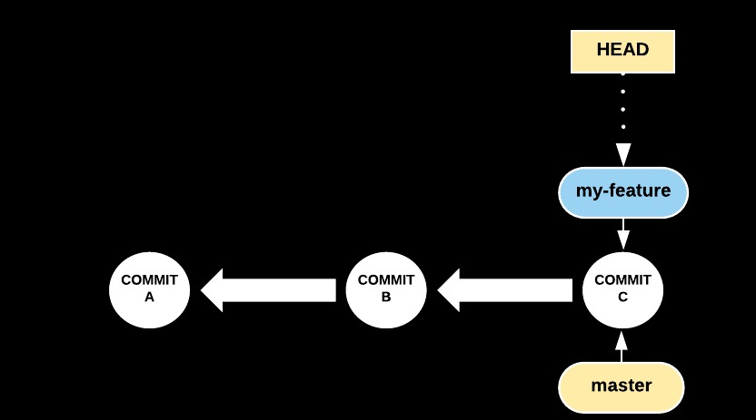
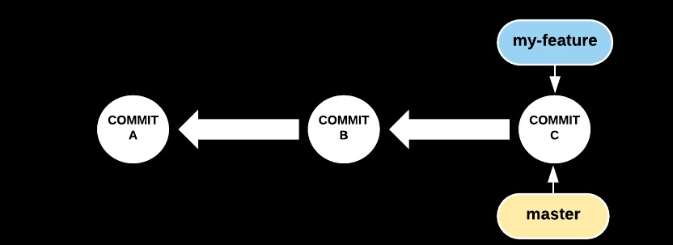
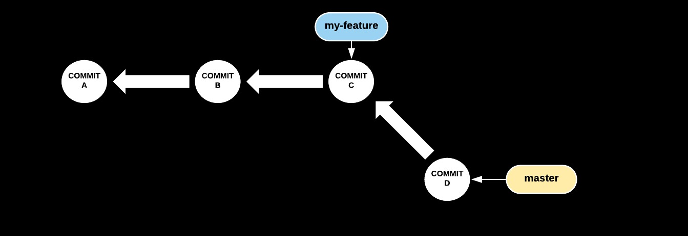
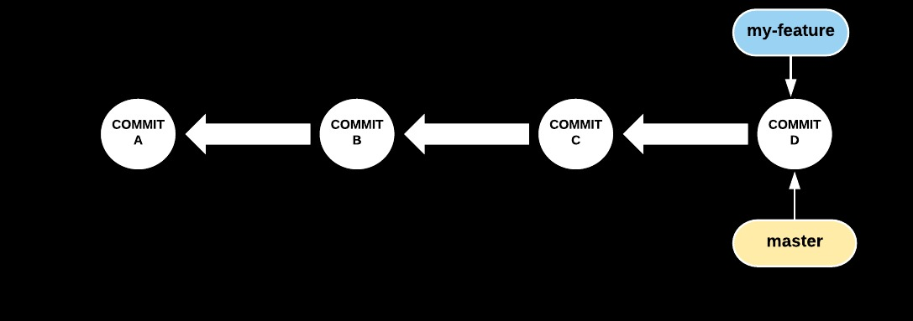
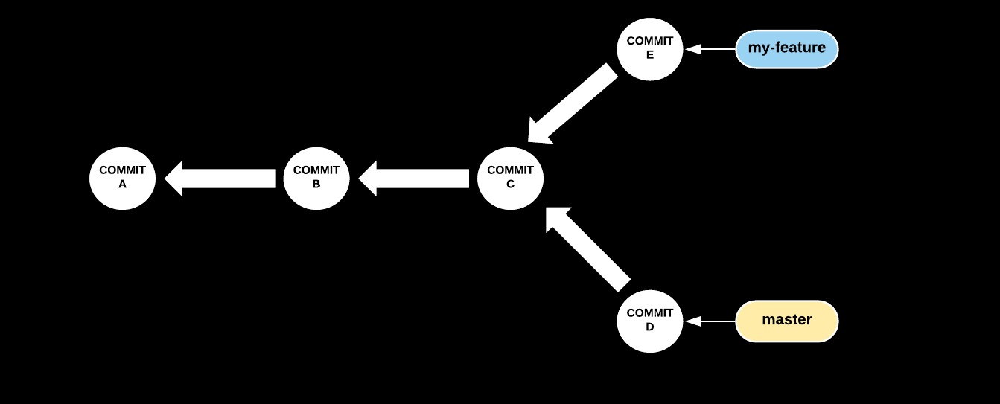
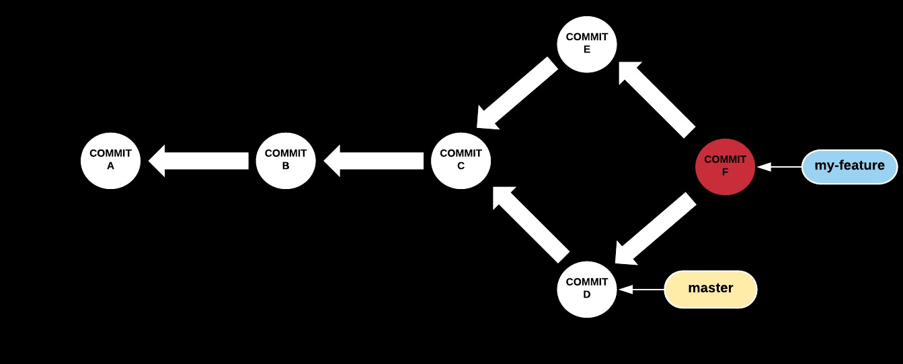
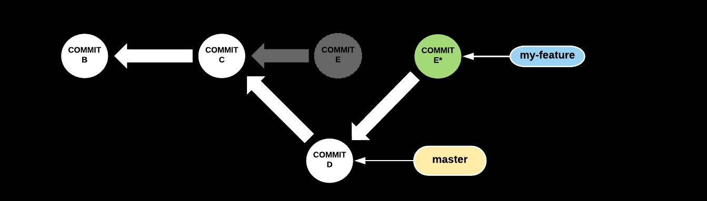

### Understanding Git

#### Even the scary parts 

---

### First, a bit about my journey so far

---

### November 2015
#### Graduate Software Engineer @ Boeing

- Never used version control before | 
- Very scared of git |
- Used Bitbucket for code reviews |

---

### July 2017
#### Software Engineer @ RedHat

- Worked on open source Beaker project |
- Use Gerrit for code reviews |
- Now less scared of git (i think...) |

---

### Topics we'll cover...

- How Git's storage works
- what is a branch
- rebase Vs. merge

---

## Storage

---

### Blob

- Git's representation of the version of a file

---

### Tree object

- Lists contents of directory
- Stores which filenames correspond to which blob, access modes...
- Points to the blob(s)

---

### Commit object

- Contains commit metadata
- Points to corresponding tree object 
- Also points to any parent commit(s)

Note:
So it can know the state of the files at the time of the commit. No parent means initial commit
---

- Subsequent commits point to corresponding parent

---

## Branch

---

### Git Branch

- A lightweight movable pointer to a commit 
- When you add a commit, the pointer moves to new commit
- Can have multiple branches

Note:
Also called refs or heads, Its like a post it note or a bookmark that says "im working here". Not stored in history. You can have more than one pointer - more than one branch

---

### Git Branch (cont.)

`git checkout -b my-feature master`

Note:
branched from master. HEAD ref points to active branch. 

---

## Rebase & Merge

Note: 
now armed with this knowledge lets take a look at rebase and merge and how they work

---

### Situation after creating the branch

---

### Case 1: New commit in master

Note:
When you updated master by pulling
---

### Let's try merging

`git merge master`

Note:
The post it gets moved. You will hear the words fast forward merge for this scenario.
---

### Case 2: Both my-feature and master have new commits

---

### Lets try merging again

Note:
F is a merge commit. see that it has 2 parents. it incorporates changes from both D and E

---

### After multiple commits & merges 

Note:
we keep merging, and the git history gets littered with merge commits. Because i used gerrit, i was only allowed to have 1 commit per CR, and thats why i had to learn how to rebase. 
---

### Case 2: Both my-feature and master have new commits

---

### Let's try rebasing this time
`git rebase master`

Note:
A new commit with same changes as E but a different parent. Old commit is garbage collected. pointer moves to new commit. git rebase also works with multiple commits. 

---

### Rebase Vs. Merge
- Both achieve the same thing
- Merge results in a "stitching pattern"
- Rebase results in a "linear" history

---

### Some Tips...
- Interactive rebase to amend old commit
`git rebase -i master`
- Pulling with rebase strategy
`git pull --rebase`
- "Squash"-ing commits with rebase

Note: 
normally git pull uses merge, but you can specify that it use rebase instead 

---

### Warning

Do not rebase public branches (that others have pushed more commits to). 
It will seem like you've "lost" some commits (don't worry - you haven't),
and you will panic.

Note:
It is possible to recover from that. But you dont want to have to do the additional work.
---

### Questions?

 

@fa[twitter gp-contact](@AnweshaChatte12)

@fa[github gp-contact](anchat1990)

@fa[medium gp-contact](@anweshachatterjee)

@fa[linkedin gp-contact](/chatterjeeanwesha)

---?image=assets/image/gitpitch-audience.jpg&opacity=100

@title[Download this Template!]

### Get your presentation started!
### [Download this template @fa[external-link gp-download]](https://gitpitch.com/template/download/black)
