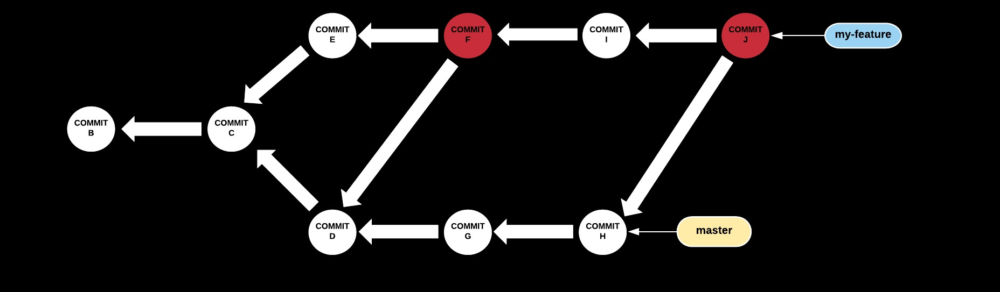

### Understanding Git

#### Even the scary parts

Note:
This is a story about how i pushed myself to go further than the git basics -
like clone, add, commit, push, pull... and learnt how to be okay with the scary
parts - which for me, was mainly git-rebase.

---

### First, a bit about my journey so far

Note:
but first I'd like to tell you about my git journey so far
---

### November 2015
#### Graduate Software Engineer @ Boeing

- Never used version control before |
- Very scared of git |
- Primarily used PyCharm tools |
- Used Bitbucket for code reviews |

Note:
bitbucket is similar to github in its pull request style.
pycharm helped provide an abstraction and i never really needed to look at the
git fundamentals. Github allows more than one commit to be associated with a
pull request !Open github! My commit messages were pretty bad too but not as bad
as these...

---

---

---
### July 2017
#### Software Engineer @ Red Hat

- Worked on open source beaker-project |
- Use Gerrit for code reviews |
- Now less scared of git (I think...) |

Note:
Gerrit has a single commit CR model. You can have only one commit associated
with a CR. This forced me to learn how to rebase as i couldnt put merge commits
into my PR !open gerrit! In order to understand rebase I needed to understand how
git works under the hood. So...

---

### Topics we'll cover...

- How git's storage works
- What is a branch
- Rebase Vs. merge

---

## Storage

---

### Blob

- Git's representation of the version of a file

---

### Tree object

- Lists contents of directory
- Stores which filenames correspond to which blob, access modes...
- Points to the blob(s)

---

### Commit object

- Contains commit metadata
- Points to corresponding tree object
- Also points to any parent commit(s)

Note:
the pointer to tree and blobs means it can know the state of the files at the
time of the commit, and it can recreate it from knowledge of the commit itself.
No parent means initial commit. More than one means merge commit.
---

- Subsequent commits point to corresponding parent

---

## Branch

---

### Git Branch

- A lightweight movable pointer to a commit
- When you add a commit, the pointer moves to new commit
- Can have multiple branches

Note:
Also called refs or heads, Its like a post it note or a bookmark that says
"im working here". Not stored in history. You can have more than one pointer -
more than one branch

---

### Git Branch (cont.)

\> `git checkout -b my-feature master`

Note:
branched from master. HEAD ref points to active branch. Now armed with this
knowledge of gits storage and branches lets take a look at rebase and merge and
how they work

---

## Rebase & Merge

Note:
Lets find out how to use rebase and merge - what to do, what not to do

---?image=assets/image/git-push-force.jpg&size=auto 90%

Note:
Dont do this.
---

### Situation after creating the branch

\> `git checkout -b my-feature master`

---

### Case 1: New commit in master

Note:
When you updated master by pulling
---

### Let's try merging

\> `git merge master`

Note:
The post it gets moved. You will hear the words fast forward merge for this scenario.
---

### Case 2: Both my-feature and master have new commits

---

### Lets try merging again

\> `git merge master`

Note:
F is a merge commit. The merge commit "ties together" history of both branches.
see that it has 2 parents. it incorporates changes from both D and E

---

### After multiple commits & merges

Note:
we keep merging, and the git history gets littered with merge commits.
Because i used gerrit, i was only allowed to have 1 commit per CR, and thats why
i had to learn how to rebase.
---

### Case 2: Both my-feature and master have new commits

---

### Let's try rebasing this time
\> `git rebase master`

Note:
A new commit with same changes as E but a different parent. Old commit is garbage collected. pointer moves to new commit. git rebase also works with multiple commits.

---

### Rebase Vs. Merge
- Both achieve the same thing |
- Merge results in a "stitching pattern" |
- Rebase results in a "linear" history |

Note:
Merge is non destructive. The reason why rebase was of special interest to me
was because of the gerrit code review model that i was talking about before.  

---

### Some Tips...
- Interactive rebase to amend/squash/fixup old commits
 
\> `git rebase -i master`

---

## Demo time!

Note:
demo* sha1 of the merge commits vs rebased commits
then * see reflog to reset * show log `git log --graph --oneline --all` * rerere

---

### Warning

Do not rebase public branches (Branches that others are working on too).
It will seem like others have "lost" some commits (don't worry - they haven't),
and you will panic.

Note:
If anyone else is working on a branch, dont rebase it. It will seem like your
workflows have diverged because you have changed history. it is possible to
recover from it, you can merge the two branches but everything will appear twice
plus a merge commit.
So say you are working on a master branch and someone else is also working on
the same branch. You push a commit, and then someone else starts basing their
work on the work you just push. If you now go and rewrite history using rebase,
the other person will have a hard time pushing his work to the repo.  
It is possible to recover from that. But you dont want to have to do the
additional work. Also this is the reason why you dont force push, others will
have a hard time pushing their work. Lastly...
---

### Don't be Scared!

Git is very forgiving, and its possible to get out of trouble for the most part.

- You cannot "lose" a commit |
- Work on a branch and "test it out" |
- Use reflog |

Note:
use cherry-pick

---

### Questions?

 

@fa[twitter gp-contact](@AnweshaChatte12)

@fa[github gp-contact](anchat1990)

@fa[medium gp-contact](@anweshachatterjee)

@fa[linkedin gp-contact](/chatterjeeanwesha)

---

### Thank you!

